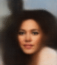
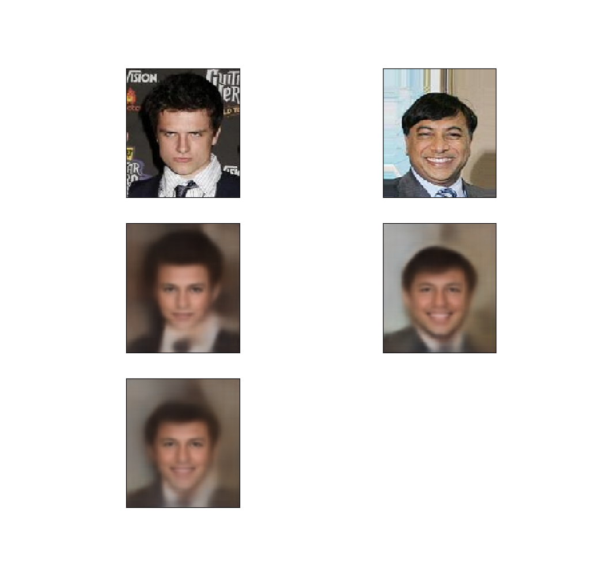

# Variational Autoencoder

This is a simple variational autoencoder written in Pytorch and trained using the CelebA dataset.

The images are scaled down to 112x128, the VAE has a latent space with 200 dimensions and it was
trained for nearly 90 epochs. 

## Results

